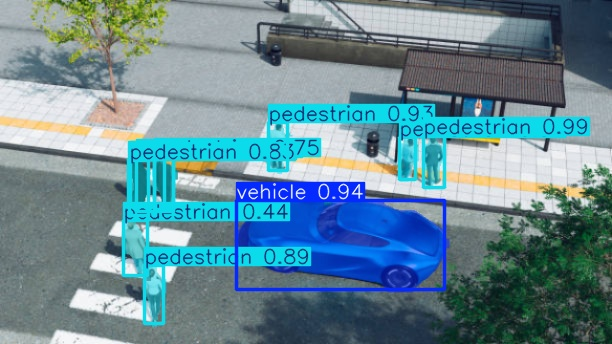
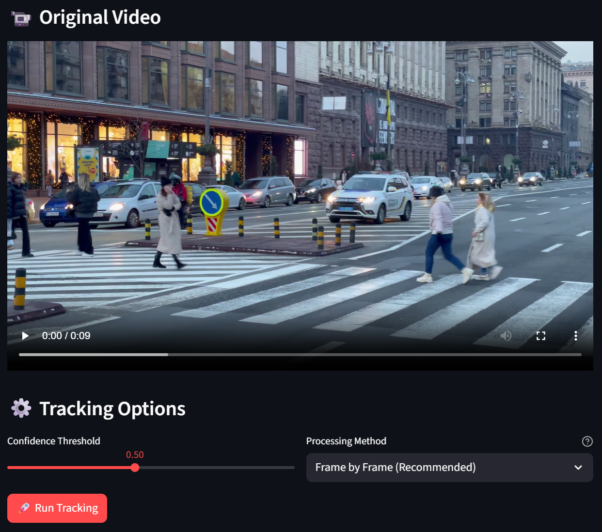
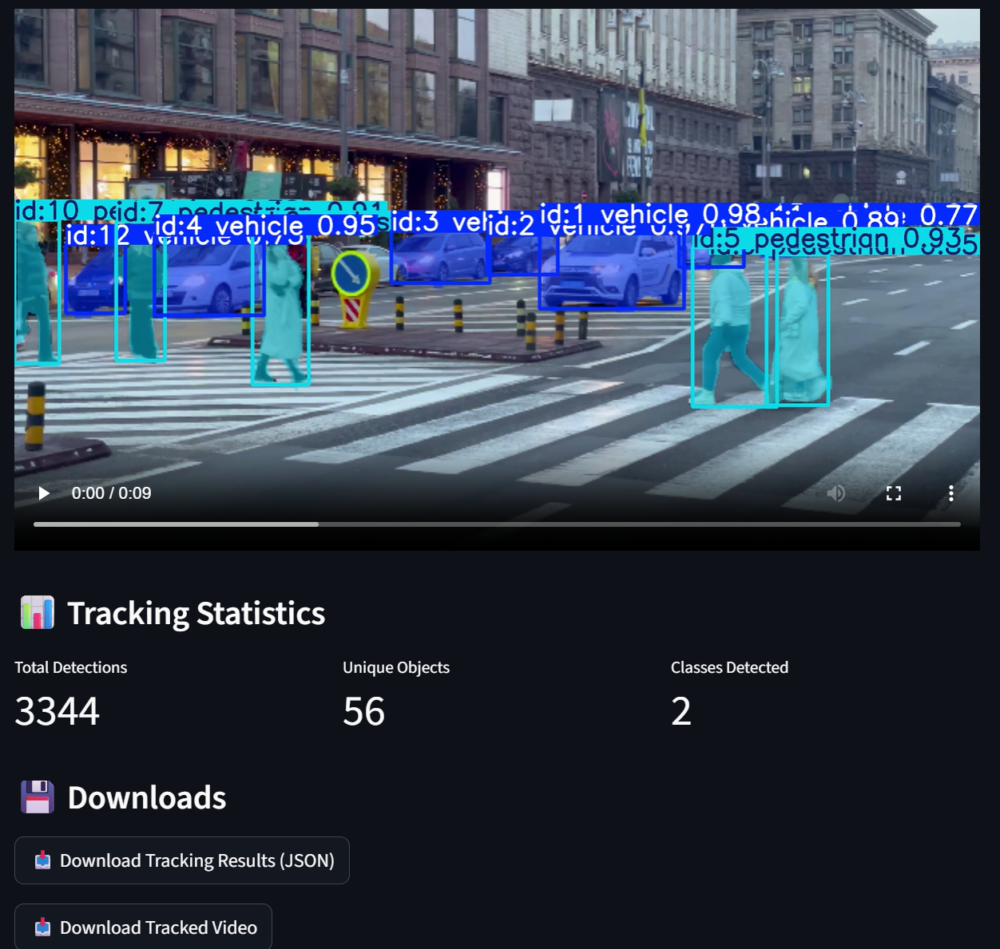

# 🚗👤 Vehicle & Pedestrian Segmentation with ByteTrack

A specialized computer vision application for **vehicle and pedestrian detection and tracking** using YOLOv8 segmentation models and ByteTrack algorithm. Built with Streamlit for easy deployment and real-time analysis.

   

## 🎯 Project Overview

This project focuses on **binary class segmentation and tracking**:
- **Class 1**: 🚗 **Vehicles** (cars, trucks, buses, motorcycles)
- **Class 2**: 👤 **Pedestrians** (people walking, standing)

### Core Technology Stack
- **YOLOv8-seg**: Instance segmentation models for precise object boundaries
- **ByteTrack**: Multi-object tracking algorithm for maintaining object identities
- **Streamlit**: Web interface for video processing and analytics
- **OpenCV**: Video processing and visualization

## 🌟 Key Features

### Segmentation & Detection
- **Instance Segmentation**: Pixel-perfect boundaries for vehicles and pedestrians
- **Real-time Processing**: Process video streams with live segmentation overlay
- **High Accuracy**: Optimized for vehicle and pedestrian detection scenarios
- **Confidence Filtering**: Adjustable confidence thresholds for each class

### Tracking Capabilities
- **ByteTrack Integration**: Robust tracking algorithm for maintaining object IDs
- **Trajectory Analysis**: Track movement paths of vehicles and pedestrians
- **Speed Estimation**: Calculate movement speed in pixels/second
- **Zone-based Counting**: Count objects entering/exiting specific zones

### Analytics & Insights
- **Class-specific Metrics**: Separate analytics for vehicles vs pedestrians
- **Movement Heatmaps**: Visualize traffic and pedestrian flow patterns
- **Time-series Analysis**: Object count variations over time
- **Export Options**: JSON, CSV, and complete analysis packages

## 📋 System Requirements

### Minimum Requirements
- **Python**: 3.8+
- **RAM**: 8GB (for segmentation models)
- **Storage**: 3GB for models and processing
- **CPU**: Multi-core processor

### Recommended Setup
- **GPU**: NVIDIA GPU with CUDA for faster inference
- **RAM**: 16GB+ for processing large videos
- **Python**: 3.9-3.11 for best compatibility

## 🚀 Installation & Setup

### 1. Clone Repository
```bash
git clone https://github.com/GoldBug79/Paarth_Pokuri.git
cd Paarth_Pokuri
```

### 2. Create Virtual Environment
```bash
python -m venv venv
# Windows
venv\Scripts\activate
# macOS/Linux  
source venv/bin/activate
```

### 3. Install Dependencies
```bash
pip install -r requirements.txt
```

### 4. Run Application
```bash
streamlit run app.py
```

## 🎛️ Model Configuration

### YOLOv8 Segmentation Models
The application supports YOLOv8 segmentation models specifically trained for vehicle and pedestrian detection:

- **yolov8n-seg.pt**: Nano model (fastest, lower accuracy)
- **yolov8s-seg.pt**: Small model (balanced)
- **yolov8m-seg.pt**: Medium model (good accuracy)
- **yolov8l-seg.pt**: Large model (high accuracy)
- **yolov8x-seg.pt**: Extra-large model (highest accuracy, slowest)

### ByteTrack Configuration
- **Track Buffer**: 30 frames (adjustable)
- **Confidence Thresholds**: Separate for vehicles and pedestrians
- **IoU Thresholds**: Optimized for segmentation masks
- **Minimum Track Length**: 10 frames to reduce noise

## 📊 Analytics Dashboard

### Real-time Metrics
- **Vehicle Count**: Total vehicles detected and tracked
- **Pedestrian Count**: Total pedestrians detected and tracked
- **Active Tracks**: Currently tracked objects
- **Average Confidence**: Model confidence per class

### Segmentation Visualizations
- **Mask Overlays**: Color-coded segmentation masks
- **Bounding Boxes**: With class labels and confidence scores
- **Tracking IDs**: Persistent identifiers across frames
- **Zone Analysis**: Entry/exit counting for defined areas

### Export Data Structure
```json
{
  "metadata": {
    "model": "yolov8s-seg.pt",
    "classes": ["vehicle", "pedestrian"],
    "total_vehicles": 145,
    "total_pedestrians": 67,
    "confidence_threshold": 0.5
  },
  "tracks": [
    {
      "frame": 10,
      "timestamp": 0.33,
      "id": 1,
      "class": "vehicle",
      "class_id": 0,
      "confidence": 0.87,
      "bbox": [100, 150, 200, 250],
      "segmentation": [[x1, y1], [x2, y2], ...],
      "center": [150, 200],
      "area_pixels": 8500,
      "speed": 15.3
    }
  ]
}
```

## 🎯 Usage Guide

### Basic Segmentation Workflow
1. **Upload Video**: Support for MP4, AVI, MOV formats
2. **Select Model**: Choose YOLOv8-seg model size
3. **Set Thresholds**: Adjust confidence for vehicles/pedestrians
4. **Process Video**: Run segmentation and tracking
5. **Analyze Results**: View dashboard and download data

### Advanced Features
- **Zone Definition**: Draw custom counting zones
- **Class-specific Filtering**: Show only vehicles or pedestrians
- **Trajectory Visualization**: Display movement paths
- **Speed Analysis**: Calculate and analyze object speeds

## 📈 Performance Benchmarks

| Model | Vehicle mAP | Pedestrian mAP | FPS (CPU) | FPS (GPU) | Memory |
|-------|-------------|----------------|-----------|-----------|---------|
| YOLOv8n-seg | 0.75 | 0.68 | 8-12 | 45-60 | 3GB |
| YOLOv8s-seg | 0.82 | 0.76 | 5-8 | 30-45 | 4GB |
| YOLOv8m-seg | 0.86 | 0.81 | 3-5 | 20-30 | 6GB |
| YOLOv8l-seg | 0.89 | 0.84 | 2-3 | 15-25 | 8GB |
| YOLOv8x-seg | 0.91 | 0.86 | 1-2 | 10-18 | 10GB |

*Benchmarks on COCO-style vehicle/pedestrian datasets*

## 🔧 Configuration Options

### Detection Settings
```python
# Vehicle detection
vehicle_confidence = 0.5  # Minimum confidence for vehicles
vehicle_iou_threshold = 0.7  # IoU threshold for NMS

# Pedestrian detection  
pedestrian_confidence = 0.4  # Minimum confidence for pedestrians
pedestrian_iou_threshold = 0.5  # IoU threshold for NMS
```

### Tracking Settings
```python
# ByteTrack parameters
track_thresh = 0.5  # Detection threshold for tracking
track_buffer = 30   # Number of frames to keep lost tracks
match_thresh = 0.8  # Matching threshold
frame_rate = 30     # Video frame rate
```

### Visualization Options
- **Mask Transparency**: 0.3 (30% transparent)
- **Vehicle Color**: Blue (#0066CC)
- **Pedestrian Color**: Red (#CC0000)
- **Track Line Thickness**: 2 pixels
- **Label Font Size**: 12pt

## 🛠️ Development

### Project Structure
```
vehicle-pedestrian-segmentation/
├── app.py                    # Main Streamlit application
├── requirements.txt          # Dependencies
├── README.md                # This file
├── models/                  # YOLOv8-seg model storage
│   ├── yolov8n-seg.pt
│   ├── yolov8s-seg.pt
│   └── ...
├── utils/
│   ├── tracker.py           # ByteTrack implementation
│   ├── segmentation.py      # Segmentation utilities
│   └── analytics.py         # Analytics functions
└── exports/                 # Generated results
```

### Key Components
- **TrafficAnalyzer**: Main segmentation and tracking class
- **ByteTrack Integration**: Multi-object tracking implementation
- **Segmentation Pipeline**: YOLOv8-seg inference pipeline
- **Analytics Engine**: Class-specific metrics calculation

## 🔍 Troubleshooting

### Common Issues

#### Model Loading
```python
# Manual model download
from ultralytics import YOLO
model = YOLO('yolov8s-seg.pt')  # Downloads automatically
```

#### Segmentation Performance
- Use smaller models (yolov8n-seg) for faster processing
- Enable GPU acceleration with CUDA
- Reduce video resolution for speed

#### Tracking Issues
- Adjust ByteTrack confidence thresholds
- Modify IoU thresholds for better matching
- Increase track buffer for crowded scenes

### Memory Optimization
```python
# For large videos
import torch
torch.cuda.empty_cache()  # Clear GPU memory
```

## 📋 Supported Formats

### Input
- **Video**: MP4, AVI, MOV, MKV
- **Models**: .pt (PyTorch), .onnx

### Output
- **Video**: MP4 with segmentation overlays
- **Data**: JSON tracking data, CSV analytics
- **Images**: Segmentation masks, trajectory plots
