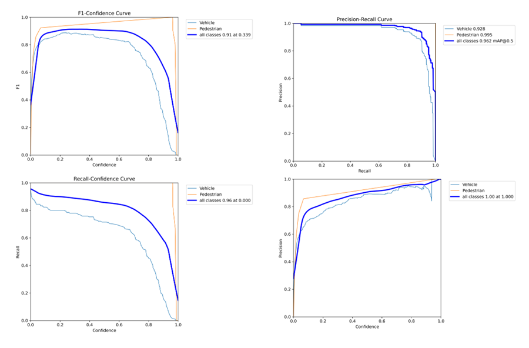
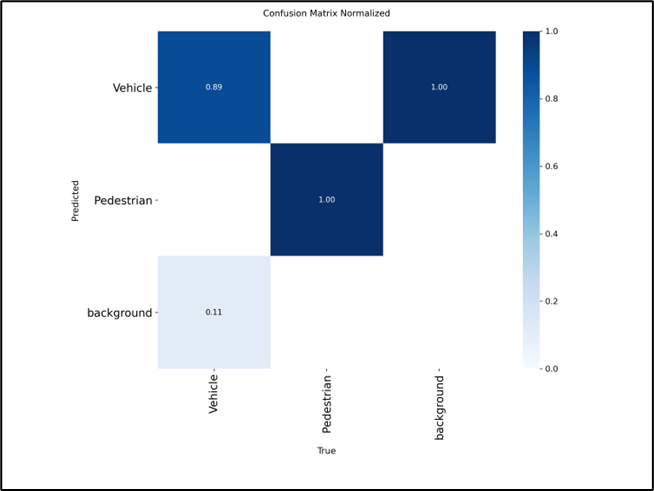
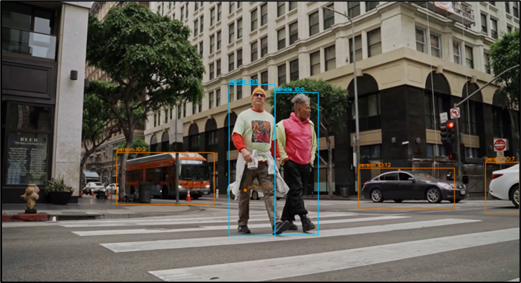
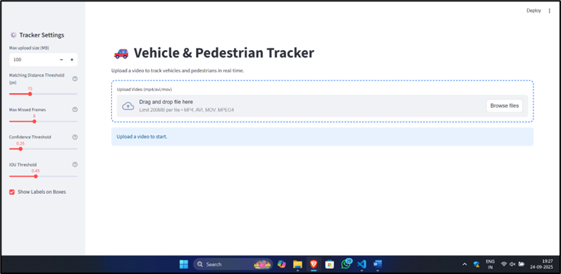

# Vehicle and Pedestrian Segmentation & Tracking

**Web App:** [Streamlit App](https://vehicle-and-pedestrian.streamlit.app/)  
**Testing & Evaluation Data:** [Google Drive Folder](https://drive.google.com/drive/folders/14WCTRHgzAPkKS2EeNOwC9tG27xJZALDt)

## Project Overview
This project implements a complete computer vision pipeline for the segmentation and tracking of vehicles and pedestrians in video streams. It detects objects, tracks them across frames, and provides annotated outputs and structured JSON data.  

**Technologies Used:**  
- Labellerr – dataset annotation  
- YOLOv11n-seg – instance segmentation  
- ByteTrack – multi-object tracking (MOT)  
- Streamlit – interactive web application  

---

## Dataset Preparation
- Collected raw images from traffic videos and public datasets  
- Annotated images with polygon masks using Labellerr  
- Defined classes: Vehicle and Pedestrian  
- Dataset split: 89 training images, 22 validation images  
- Images varied in resolution (720p–1080p) and conditions  

---

## Model Training & Evaluation
- **Model:** YOLOv11n-seg  
- **Epochs:** 100  
- **Image Size:** 640×640  
- **Classes:** Vehicle, Pedestrian  
- **Hardware:** Google Colab T4 GPU  

**Validation Metrics:**  
- Box mAP50-95: 0.48  
- Box mAP50: 0.76  
- Mask mAP50-95: 0.44  
- Mask mAP50: 0.72  

***Model Evaluation Curves***
- 

***Confusion Matrix***
- 

***Final Tracked Video Screenshot Image***
- 

***Final Interface Screenshot Image***
- 
---

## Development Workflow
1. **Data Exploration** – analyzed dataset variations and annotation quality  
2. **Model Training & Tuning** – optimized batch size, augmentations, and hyperparameters  
3. **System Integration** – integrated YOLOv11 with ByteTrack and deployed via Streamlit  

---

## Challenges & Solutions
- **Overlapping Objects:** Improved anchors and training samples  
- **Inconsistent Tracking IDs:** Tuned ByteTrack parameters  
- **Web App Lag:** Compressed videos and added progress indicators  
- **Misclassification:** Dataset expansion and refined annotations (future improvement)  

***Workflow Diagram***
- 

---

## Conclusion
- High-quality annotations and hyperparameter tuning are key for segmentation and tracking accuracy  
- Streamlit enables rapid deployment but requires video optimization  
- Future work: larger datasets, more classes, improved architectures, cloud-based streaming  

**Web App:** [Streamlit App](https://vehicle-and-pedestrian.streamlit.app/)  
**Testing & Evaluation Data:** [Google Drive Folder](https://drive.google.com/drive/folders/14WCTRHgzAPkKS2EeNOwC9tG27xJZALDt)
