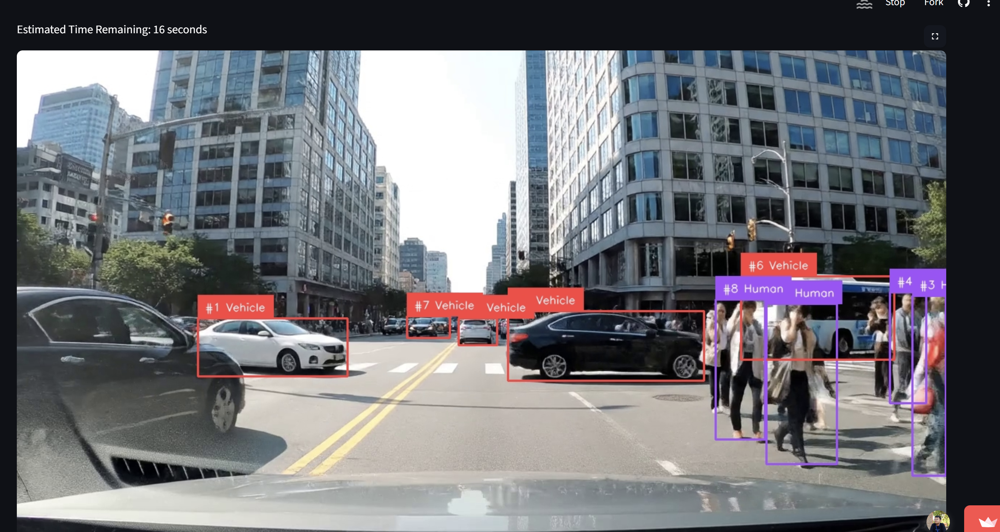

# End-to-End Vehicle & Pedestrian Tracking System

This repository contains the full implementation of an end-to-end computer vision pipeline for segmenting and tracking vehicles and pedestrians, developed as part of the hiring process for Labellerr AI.

The project covers the entire machine learning lifecycle: from data annotation and model training to building an interactive web application for real-time inference.

---

## 🚀 Live Demo

You can access and interact with the live application here:

**[https://labellerr-project.streamlit.app](https://labellerr-project.streamlit.app)**


*(To add a screenshot: take a picture of your running app, name the file `screenshot.png`, and upload it to your GitHub repository.)*

---

## ✨ Key Features

- **Custom Model Training:** A YOLOv8n-seg model was fine-tuned on a custom dataset annotated using the Labellerr platform.
- **Real-time Object Tracking:** Integrates the ByteTrack algorithm via the `supervision` library to maintain object IDs across video frames.
- **Interactive Web UI:** A user-friendly web interface built with Streamlit allows for easy video uploads and interaction.
- **Live Progress & ETA:** The application displays a live progress bar and an estimated time remaining during video processing.
- **Multiple Result Formats:** Users can download:
  - The full annotated video.
  - A `results.json` file with detailed tracking data (frame number, tracker ID, class, bounding box).
  - A gallery of sample annotated frames.

---

## 🛠️ Tech Stack

- **Model:** Ultralytics YOLOv8-seg
- **Tracking:** ByteTrack (`supervision` library)
- **Web Framework:** Streamlit
- **Data Annotation:** Labellerr Platform
- **Core Libraries:** PyTorch, OpenCV, Pandas

---

## ⚙️ Local Setup and Usage

To run this project on your local machine, follow these steps:

**1. Clone the Repository**
```bash
git clone <your-repository-url>
cd <repository-folder>